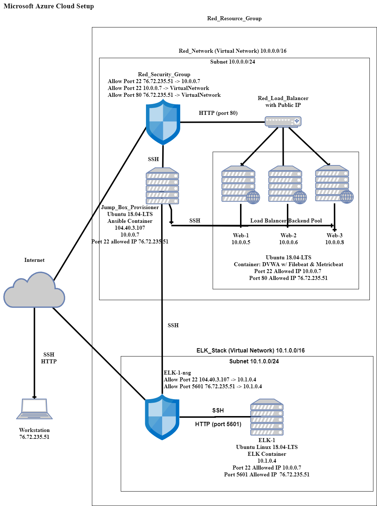
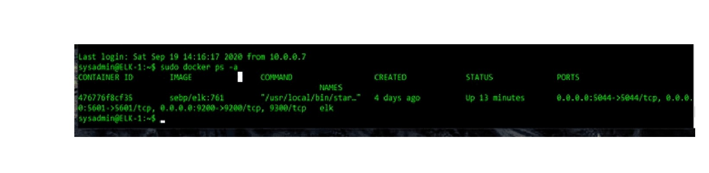

## Automated ELK Stack Deployment

The files in this repository were used to configure the network depicted below.

These files have been tested and used to generate a live ELK deployment on Azure. They can be used to recreate the entire deployment pictured above. Alternatively, the listed files may to deployed selectively to install only certain pieces of it, such as Filebeat.

  - Install_dvwa.yml
  - Install_ELK.yml
  - Filebeat.yml
  - metricbeat.yml

This document contains the following details:
- Description of the Topology
- Access Policies
- ELK Configuration
  - Beats in Use
  - Machines Being Monitored
- How to Use the Ansible Build

### Description of the Topology

The main purpose of this network is to expose a load-balanced and monitored instance of DVWA, the D*mn Vulnerable Web Application.

Load balancing ensures that the application will be highly available. In addition, a jump box is deployed to provide a more secure environment by restricting access to the network.

Integrating an ELK server allows users to easily monitor the vulnerable VMs for changes to the docker metrics, and to monitor and aggregate system log files.

The configuration details of each machine may be found below.

| Name     |  Function  | IP Address | Operating System |
|----------|------------|------------|------------------|
| Jump Box | Gateway    | 10.0.0.7   | Linux            |
| Web-1    | Web Server | 10.0.0.5   | Linux            |
| Web-2    | Web Server | 10.0.0.6   | Linux            |
| Web-3    | Web Server | 10.0.0.8   | Linux            |
| ELK-1    | ELK server | 10.1.0.4   | Linux            |

### Access Policies

The web machines on the internal red_network are not exposed to the public Internet. 

Only the jump box machine can accept connections from the Internet. Access to this machine is only allowed from the following IP addresses:

 - 76.72.235.51

Web machines within the red_network can only be accessed by the jump box (IP Address 104.40.3 107).

A summary of the access policies in place can be found in the table below.

| Name     | Publicly Accessible | Allowed IP Addresses |
|----------|---------------------|----------------------|
| Jump Box | Yes                 | 76.72.235.51         |
| Web-1    | No                  |                      |
| Web-2    | No                  |                      |
| Web-3    | No                  |                      |
| ELK-1    | Yes                 | 76.72.235.51         |

### Elk Configuration

Ansible was used to automate configuration of the ELK machine. No configuration was performed manually, which is advantageous because automation can dramatically improve the consistancy and reliablility of your environment, as well as bringing huge time savings when configuring large numbers of servers. 

The ELK playbook implements the following tasks:

- Increase virtual memory
- Install docker and python3-pip
- Install docker module
- Download elk container image
- Enable docker service

The following screenshot displays the result of running `docker ps` after successfully configuring the ELK instance.

### Target Machines & Beats
This ELK server is configured to monitor the following machines:

 - Web-1 10.0.0.5
 - Web-2 10.0.0.6
 - Web-3 10.0.0.8

We have installed the following Beats on these machines:

 - filebeat
 - metricbeat

These Beats allow us to collect the following information from each machine:
- Filebeat monitors system log files and collects log events. Which we can use to track syslog events by hostname, SSH logins and sudo commands by user.
- Metricbeat collects metrics about our docker containers, such as, name and number of containers, and container CPU and Memory usage.

### Using the Playbooks
In order to use the playbooks, you will need to have an Ansible control node already configured. Assuming you have such a control node provisioned: 

SSH into the control node and follow the steps below:

##### Install dvwa playbook:
- Copy the install-dvwa.yml file to the /etc/ansible directory.
- Update the /etc/ansible/hosts file to include the target Webserver VMs (IP Addresses 10.0.0.5, 10.0.0.6, 10.0.0.8) under the [webservers] header line.
- Run the playbook, and navigate to the Red_Load_Balancer public IP address (IP Address 23.99.86.175/setup.php) to check that the installation worked as expected.

##### Install elk playbook:
- Copy the install-elk.yml file to the /etc/ansible directory.
- Update the /etc/ansible/hosts file to include the target ELK VM (IP Address 10.1.0.4) under a [elk] header line.
- Run the playbook, and navigate to the ELK VM public IP Address (20.185.59.91:5601/app/kibana) to check that the installation worked as expected.

##### Filebeat playbook:
- Copy the filebeat.yml file to the /etc/ansible/roles directory.
- Confirm the /etc/ansible/hosts file includes the target Webserver VMs (IP Address 10.0.0.5, 10.0.0.6, 10.0.0.8) under the [webservers] header line.
- Run the playbook, and navigate to the ELK VM public IP Address (20.185.59.91:5601/app/kibana), add log data, and confirm data is being received.

##### Metricbeat playbook:
- Copy the metricbeat.yml file to the /etc/ansible/roles directory.
- Confirm the /etc/ansible/hosts file includes the target Webserver VMs (IP Address 10.0.0.5, 10.0.0.6, 10.0.0.8) under the [webservers] header line.
- Run the playbook, and navigate to the ELK VM public IP Address (20.185.59.91:5601/app/kibana), add metric data, and confirm data is being received.
